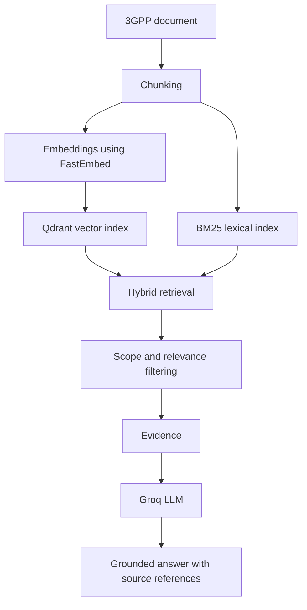

# 3GPP Standards RAG Chatbot

This project is a chatbot that answers questions from an indexed 3GPP standards document.

It is designed to minimize hallucinations by forcing answers to be based on retrieved evidence.

Repository: https://github.com/GAURAV0440/Telecom-Chatbot

## 1. Project Title

3GPP Standards RAG Chatbot

## 2. Short Professional Description

This is an AI assistant for telecom standards Q&A.

- Current indexed document: TS 36.413 V19.2.0
- Knowledge scope: only indexed 3GPP content
- Refusal behavior: rejects unsupported questions with a fixed message

## 3. Key Features

- Answers from indexed 3GPP evidence only
- Hybrid retrieval (semantic + lexical)
- Explicit out-of-scope rejection
- Evidence filtering before LLM generation
- Source metadata in responses (specification, version, section)
- FastAPI backend and Streamlit frontend
- Retrieval and LLM evaluation scripts

## 4. Problem Statement

Large language models can produce confident but unsupported answers.

For standards work, answers must be traceable to source text. This project was built to answer standards questions while rejecting unsupported or unrelated questions.

## 5. Solution Overview

The chatbot uses RAG.

RAG (Retrieval-Augmented Generation) means:

1. First, the system retrieves relevant text from indexed documents.
2. Then, it generates an answer using only that retrieved text.

If evidence is not sufficient, it returns:

I don't have sufficient evidence in the provided 3GPP standards.

## Quick Start

Use these steps in order from a fresh clone.

1. Clone the repository

```bash
git clone https://github.com/GAURAV0440/Telecom-Chatbot.git
```

2. Enter the project directory

```bash
cd Telecom-Chatbot
```

3. Create a Python virtual environment

```bash
python -m venv .venv
```

4. Activate it

```bash
source .venv/bin/activate
```

5. Install dependencies

```bash
pip install -r requirements.txt
```

6. Create your environment file

```bash
cp .env.example .env
```

7. Edit .env and set GROQ_API_KEY

8. ZIP/database setup
   - The repository already includes ready-to-use processed and indexed retrieval data.
   - You can run the app directly after configuring .env.
   - Details are in the ZIP section below.

9. Start backend in Terminal 1

```bash
uvicorn backend.app.main:app --reload
```

10. Start frontend in Terminal 2

```bash
streamlit run frontend/app.py
```

11. Open the frontend URL shown by Streamlit (usually http://localhost:8501)

12. Ask a test question
   - What is the purpose of the S1AP Reset procedure?

## 6. Architecture



## 7. RAG Pipeline

Simple pipeline flow:

1. The document is split into chunks.
2. Each chunk is converted into embeddings.
   - Embeddings are numeric representations of text meaning.
3. Embeddings are stored in Qdrant.
   - Qdrant is a vector database used for similarity search.
4. BM25 lexical retrieval is also used.
   - BM25 is a keyword matching method.
5. The system combines semantic + lexical results.
6. Filtering removes weak or out-of-scope evidence.
7. The LLM answers from the filtered evidence.
8. If evidence is weak, the system refuses.

## 8. Retrieval Strategy

Hybrid retrieval combines two methods:

- Semantic retrieval:
  - FastEmbed
  - Model: BAAI/bge-small-en-v1.5
  - Vector store: Qdrant
- Lexical retrieval:
  - BM25 via rank-bm25

Why both are used:

- Semantic search helps with meaning-level matches.
- BM25 helps with exact terms and protocol keywords.
- Combined scoring improves evidence quality.

Additional checks in retrieval:

- Scope checking
- Semantic score filtering
- Hybrid score filtering
- Lexical overlap filtering
- Technical phrase matching checks

## 9. Hallucination Mitigation

This project is designed to minimize hallucinations, not guarantee zero hallucinations.

Implemented controls:

1. Restricted source
   - Retrieval is from indexed 3GPP content only.
2. Scope filtering
   - Known out-of-scope topics are rejected.
3. Hybrid retrieval
   - Semantic + lexical retrieval improves evidence matching.
4. Evidence thresholds
   - Low-quality matches are filtered out.
5. Evidence-only prompting
   - LLM is instructed to use only provided evidence.
6. Fixed refusal message
   - Used when evidence is missing or insufficient.
7. Source-aware output
   - Evidence includes specification/version/section metadata.

## 10. Technology Stack

| Layer | Technology |
|---|---|
| Language | Python |
| Backend API | FastAPI |
| Frontend | Streamlit |
| Embeddings | FastEmbed |
| Embedding model | BAAI/bge-small-en-v1.5 |
| Vector database | Qdrant (local path mode) |
| Lexical retrieval | rank-bm25 |
| LLM provider | Groq |
| Document parsing | python-docx |
| Config and validation | pydantic, pydantic-settings |

## 11. Project Structure

```text
3gpp-rag-chatbot/
├── LICENSE
├── README.md
├── requirements.txt
├── backend/
│   ├── app/
│   │   ├── config.py
│   │   ├── evaluate.py
│   │   ├── ingestion.py
│   │   ├── llm.py
│   │   ├── main.py
│   │   ├── rag.py
│   │   ├── retrieval.py
│   │   └── vector_store.py
│   ├── data/
│   │   ├── documents/
│   │   ├── processed/
│   │   └── qdrant/
│   └── tests/
│       └── evaluation_questions.json
└── frontend/
    └── app.py
```

Main responsibilities:

- backend/app/main.py
  - FastAPI app and chat endpoint.
- backend/app/rag.py
  - Retrieval + answer orchestration.
- backend/app/retrieval.py
  - Hybrid search and filtering logic.
- backend/app/llm.py
  - Groq prompt and response generation.
- backend/app/evaluate.py
  - Retrieval and LLM evaluation runner.
- frontend/app.py
  - Chat UI.

## 12. Installation

```bash
python -m venv .venv
source .venv/bin/activate
pip install -r requirements.txt
```

## 13. Environment Configuration

Create .env from .env.example:

```bash
cp .env.example .env
```

Set at least these values:

```env
GROQ_API_KEY=YOUR_GROQ_API_KEY
GROQ_MODEL=llama-3.3-70b-versatile

EMBEDDING_MODEL=BAAI/bge-small-en-v1.5
QDRANT_PATH=./backend/data/qdrant
QDRANT_COLLECTION=3gpp_documents
```

Important:

- Keep .env private.
- Do not commit API keys.

## 14. Running the Backend

Terminal 1:

```bash
source .venv/bin/activate
uvicorn backend.app.main:app --reload
```

Optional health check:

```bash
curl http://127.0.0.1:8000/health
```

## 15. Running the Frontend

Terminal 2:

```bash
source .venv/bin/activate
streamlit run frontend/app.py
```

## 16. API Usage

Endpoint:

- POST /chat

Request example:

```json
{
  "question": "What is the purpose of the S1AP Reset procedure?"
}
```

Response contains:

- answer
- evidence

## 17. Example Questions

In-scope examples:

- What services does S1AP provide?
- What is E-RAB setup in S1AP?
- Explain the S1AP handover preparation procedure.
- What does the E-RAB SETUP REQUEST message contain?

Out-of-scope examples:

- What is the capital of France?
- Who is the current Prime Minister of India?
- Explain Python decorators.
- What is NGAP?
- What is 5G NAS?
- What is the weather in Delhi today?
- Explain how TCP congestion control works.

Out-of-scope response:

I don't have sufficient evidence in the provided 3GPP standards.

## 18. Evaluation

Evaluation set:

- 25 total questions
- 15 in-scope
- 10 out-of-scope

Run retrieval evaluation:

```bash
python -m backend.app.evaluate --retrieval-only
```

Run LLM spot evaluation:

```bash
python -m backend.app.evaluate --llm --limit 3
```

## 19. Evaluation Results

- Retrieval evaluation: 25/25, 100.0%
- LLM spot evaluation: 3/3 on tested sample

How to interpret this:

- Retrieval result is from the full 25-question set.
- LLM result is only a small sample and is not a full LLM accuracy claim.

## ZIP / Database Setup (Important)

This repository currently includes these relevant files/folders:

- ZIP file: backend/data/documents/36413-j20.zip
- Document file: backend/data/documents/36413-j20.docx
- Processed chunks: backend/data/processed/ts_36_413_chunks.json
- Local Qdrant index: backend/data/qdrant/

What the ZIP is used for:

- The ZIP in backend/data/documents is a document archive.
- The app runtime retrieval depends on processed chunks and the Qdrant index paths above.

Practical fresh-clone setup:

- For normal usage, start directly with the included processed/indexed data.
- You do not need to run ingestion or vector indexing to use the chatbot.

If you still want to extract the ZIP manually:

```bash
unzip backend/data/documents/36413-j20.zip -d backend/data/documents/
```

After extraction, confirm these exist:

- backend/data/documents/36413-j20.docx
- backend/data/processed/ts_36_413_chunks.json
- backend/data/qdrant/meta.json
- backend/data/qdrant/collection/3gpp_documents/storage.sqlite

## 20. Limitations

- Retrieval scope is tuned to the indexed TS 36.413 document.
- Out-of-scope detection is rule-based.
- LLM outputs depend on available evidence and API availability.
- LLM evaluation currently uses a limited sample.

## 21. Future Improvements

- Add more indexed 3GPP standards.
- Expand LLM evaluation coverage.
- Add broader automated testing and observability.

## 22. Security / API Key Handling

- Store secrets only in .env.
- Never commit .env.
- Never commit real API keys.

## 23. Technical Design Decisions

Why RAG:

- It grounds generation in retrieved document evidence.

Why hybrid retrieval:

- Semantic search finds meaning-level matches.
- BM25 strengthens exact keyword matching.

Why filtering thresholds:

- They reduce weak evidence before generation.

Why refusal behavior:

- It avoids unsupported answers when evidence is insufficient.

Why Groq:

- It is the LLM provider used by this implementation.

