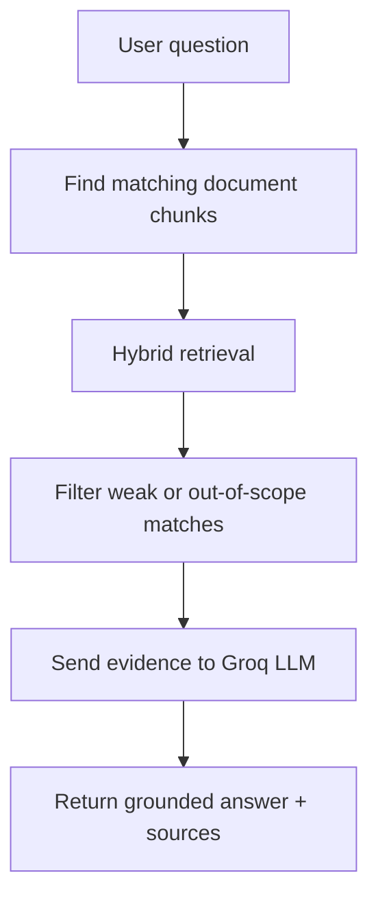

# 3GPP Standards RAG Chatbot

This project is a chatbot for 3GPP telecom standards.

It answers questions using only the document data stored in this repository.

It is built to reduce hallucinations (wrong answers made up by AI).

Repository: https://github.com/GAURAV0440/Telecom-Chatbot

## What This Project Does

- Reads user questions about the indexed 3GPP standard.
- Finds matching text from stored evidence.
- Generates an answer from that evidence.
- Refuses to answer if evidence is missing.

Current indexed standard:

- TS 36.413 V19.2.0

## Why This Was Built

Normal AI chatbots can sound correct but still give wrong technical details.

For standards work, answers should come from source text. This project was built to keep answers grounded in actual 3GPP evidence.

## Simple Meaning of RAG

RAG means Retrieval-Augmented Generation.

In simple words:

1. Retrieval: the system first searches its stored 3GPP text.
2. Generation: then it writes an answer using only that text.

If good evidence is not found, it returns this exact message:

I don't have sufficient evidence in the provided 3GPP standards.

## Quick Start (Fresh Clone)

Follow these steps in the same order.

1. Clone repository

```bash
git clone https://github.com/GAURAV0440/Telecom-Chatbot.git
```

2. Go into project folder

```bash
cd Telecom-Chatbot
```

3. Create virtual environment

```bash
python -m venv .venv
```

4. Activate virtual environment

```bash
source .venv/bin/activate
```

5. Install dependencies

```bash
pip install -r requirements.txt
```

6. Create environment file

```bash
cp .env.example .env
```

7. Open .env and set your Groq API key

8. Start backend (Terminal 1)

```bash
source .venv/bin/activate
uvicorn backend.app.main:app --reload
```

9. Start frontend (Terminal 2)

```bash
source .venv/bin/activate
streamlit run frontend/app.py
```

10. Open Streamlit URL shown in terminal (usually http://localhost:8501)

11. Ask a test question, for example:
    - What is the purpose of the S1AP Reset procedure?

## ZIP / Database Setup (Important)

This repository already includes ready data needed by retrieval:

- backend/data/processed/ts_36_413_chunks.json
- backend/data/qdrant/meta.json
- backend/data/qdrant/collection/3gpp_documents/storage.sqlite

ZIP location in repository:

- backend/data/documents/36413-j20.zip

What the ZIP is:

- It is a compressed copy of a source document.

Do you need to extract it to run the app?

- No, not for normal use.
- The app can run directly with the already included processed and indexed data.

If you still want to extract it manually:

```bash
unzip backend/data/documents/36413-j20.zip -d backend/data/documents/
```

After extraction, this file should exist:

- backend/data/documents/36413-j20.docx

Do you need to run ingestion or vector indexing again?

- No, not for normal fresh-clone usage.

## How It Works (Simple Flow)



Important terms:

- Embeddings: number-based text representations used for meaning search.
- Qdrant: vector database used to store and search embeddings.
- BM25: keyword-based retrieval method.
- Hybrid retrieval: using semantic search and BM25 together.

## Tech Stack

- Python
- FastAPI (backend API)
- Streamlit (frontend UI)
- FastEmbed (embeddings)
- BAAI/bge-small-en-v1.5 (embedding model)
- Qdrant (local vector store)
- rank-bm25 (keyword retrieval)
- Groq (LLM provider)

## Project Structure

```text
3gpp-rag-chatbot/
├── README.md
├── requirements.txt
├── backend/
│   ├── app/
│   │   ├── config.py
│   │   ├── evaluate.py
│   │   ├── ingestion.py
│   │   ├── llm.py
│   │   ├── main.py
│   │   ├── rag.py
│   │   ├── retrieval.py
│   │   └── vector_store.py
│   ├── data/
│   │   ├── documents/
│   │   ├── processed/
│   │   └── qdrant/
│   └── tests/
│       └── evaluation_questions.json
└── frontend/
    └── app.py
```

## API

Main endpoint:

- POST /chat

Example request:

```json
{
  "question": "What is the purpose of the S1AP Reset procedure?"
}
```

Response includes:

- answer
- evidence

## Example Questions

In-scope examples:

- What services does S1AP provide?
- What is E-RAB setup in S1AP?
- Explain the S1AP handover preparation procedure.
- What does the E-RAB SETUP REQUEST message contain?

Out-of-scope examples:

- What is the capital of France?
- Who is the current Prime Minister of India?
- Explain Python decorators.
- What is NGAP?
- What is 5G NAS?
- What is the weather in Delhi today?

Out-of-scope output:

I don't have sufficient evidence in the provided 3GPP standards.

## Evaluation

Question set:

- 25 total questions
- 15 in-scope
- 10 out-of-scope

Run retrieval evaluation:

```bash
python -m backend.app.evaluate --retrieval-only
```

Run LLM spot evaluation:

```bash
python -m backend.app.evaluate --llm --limit 3
```

Results:

- Retrieval: 25/25 (100.0%)
- LLM spot check: 3/3 on tested sample

How to read these results:

- Retrieval result is from all 25 questions.
- LLM result is only a small sample, not full-model accuracy.

## Security

- Keep API keys in .env only.
- Never commit .env to Git.
- Never share real API keys.

